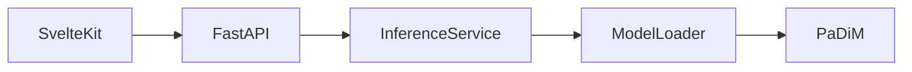

# Vision Inspector

AIによる画像異常検知Webアプリケーションです。

Anomalib（PaDiM）を利用し、画像をアップロードするだけで異常箇所を検出し、ヒートマップ付きの異常マップをブラウザ上で確認できます。

FastAPI・SvelteKit・Docker・uvを利用し、実務を意識した構成で開発しています。

---

## スクリーンショット

### ホーム画面


---

### 推論結果


---

### 正常画像


---

### 異常画像


---

## 特徴

- PaDiMによる画像異常検知
- 異常ヒートマップ生成
- 元画像とOverlay画像の比較表示
- FastAPI + SvelteKit構成
- Dockerによる開発環境
- uvによるPythonパッケージ管理
- Ruff・Pyright・pytestによる品質管理
- GitHub ActionsによるCI

---

## システム構成



---

## アーキテクチャ

```
Frontend (SvelteKit)
        │
        ▼
FastAPI
        │
        ▼
InferenceService
        │
        ▼
ModelLoader
        │
        ▼
PaDiM (Anomalib)
```

---

## ディレクトリ構成

```text
VisionInspector
├── backend
│   ├── app
│   ├── checkpoints
│   ├── tests
│   └── pyproject.toml
│
├── frontend
│   ├── src
│   ├── static
│   └── package.json
│
├── docker-compose.yml
└── README.md
```

---

## 技術スタック

| 分類            | 技術                                |
| --------------- | ----------------------------------- |
| Frontend        | SvelteKit 2 / Svelte 5 / TypeScript |
| Backend         | FastAPI                             |
| AI              | Anomalib (PaDiM)                    |
| Deep Learning   | PyTorch                             |
| Package Manager | uv                                  |
| Lint            | Ruff                                |
| Type Check      | Pyright                             |
| Test            | pytest                              |
| CI              | GitHub Actions                      |
| Container       | Docker                              |

---

## API

### POST /predict

画像をアップロードして異常検知を実行します。

### Request

```
multipart/form-data

file : 画像ファイル
model : padim
```

### Response

```json
{
  "model": "padim",
  "score": 0.743,
  "label": true,
  "message": "Anomaly detected",
  "description": "モデルが異常の可能性が高いと判定しました。オーバーレイ画像で異常箇所を確認してください。",
  "overlay_url": "/outputs/xxxxxxxx.png",
  "processing_time_ms": 138.6
}
```

---

## セットアップ

### Docker

```bash
git clone <repository>

cd VisionInspector

docker compose up --build
```

Frontend

```
http://localhost:5173
```

Backend

```
http://localhost:8000
```

Swagger UI

```
http://localhost:8000/docs
```

---

## 設計思想

### Service層

推論ロジックをAPI層から分離し、責務を明確化しています。

APIはHTTPリクエストのみを扱い、画像推論はService層が担当します。

---

### ModelLoader

AIモデルの生成・管理をModelLoaderへ集約しています。

将来的にPatchCoreやEfficientADを追加しても、APIやServiceを変更することなく拡張できる構成です。

---

### コンポーネント設計

フロントエンドは

- UIコンポーネント
- Featureコンポーネント

を分離しています。

```text
components
├── ui
└── features
```

これにより、再利用性・保守性を高めています。

---

### Svelte 5

Svelte 5のRunesを採用しています。

親子コンポーネント間の通信は `createEventDispatcher` を使用せず、コールバックPropsで統一しています。

---

### 型安全

Backend

- Pydantic
- Pyright

Frontend

- TypeScript

を利用し、型安全を重視しています。

---

## 品質管理

以下のツールを導入しています。

- Ruff
- Pyright
- pytest
- pre-commit
- GitHub Actions

コミット時およびPush時に自動で品質チェックが実行されます。

---

## 今後の予定

- PatchCore対応
- EfficientAD対応
- モデル切り替え機能
- 推論履歴
- Docker Compose改善
- クラウドデプロイ
- デモ動画作成

---

## ライセンス

MIT License
