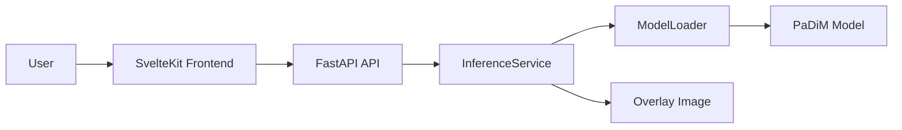

# Vision Inspector

深層学習を用いた画像異常検知Webアプリケーションです。  
製造業の外観検査を想定し、画像をアップロードすると異常スコアと異常箇所のヒートマップを返します。

---

## 概要

Vision Inspector は、画像異常検知モデルをWeb APIとして利用できるようにしたアプリケーションです。

現在は `PaDiM` を用いて、MVTec AD の bottle データセットで学習したモデルを利用しています。

今後は `PatchCore` や `EfficientAD` など、複数の異常検知モデルを切り替えられる構成へ拡張予定です。

---

## 主な機能

- 画像アップロード
- 画像単位の異常判定
- 異常スコアの算出
- 異常マップの生成
- 元画像へのヒートマップ重ね合わせ
- FastAPIによる推論API
- Docker + uv による再現可能な開発環境
- pytest / Ruff / Pyright / pre-commit / GitHub Actions による品質管理

---

## 使用技術

### Backend

- Python 3.12
- FastAPI
- PyTorch
- Anomalib
- OpenCV
- uv
- Docker

### Quality

- pytest
- Ruff
- Pyright
- pre-commit
- GitHub Actions

### Frontend

今後 SvelteKit / TypeScript / Tailwind CSS で実装予定です。

---

## システム構成



---

## ディレクトリ構成

```text
VisionInspector/
├── backend/
│   ├── app/
│   │   ├── api/
│   │   ├── core/
│   │   ├── schemas/
│   │   ├── services/
│   │   ├── utils/
│   │   ├── dependencies.py
│   │   └── main.py
│   ├── tests/
│   ├── checkpoints/
│   ├── outputs/
│   ├── Dockerfile
│   ├── docker-compose.yml
│   └── pyproject.toml
├── notebooks/
├── frontend/
└── README.md
```

---

## セットアップ

### Backend

```bash
cd backend
docker compose up --build
```

起動後、以下にアクセスします。

```text
http://localhost:8000
```

Swagger UI:

```text
http://localhost:8000/docs
```

---

## API仕様

### POST `/predict`

画像をアップロードし、異常検知を実行します。

#### Query Parameters

| Name  | Type   | Description                         |
| ----- | ------ | ----------------------------------- |
| model | string | 使用モデル。現在は `padim` のみ対応 |

#### Request

`multipart/form-data`

| Field | Type  | Description             |
| ----- | ----- | ----------------------- |
| file  | image | jpg / jpeg / png / webp |

#### Response

```json
{
  "model": "padim",
  "score": 0.98,
  "label": true,
  "message": "Anomaly detected",
  "overlay_url": "/outputs/example.png",
  "processing_time_ms": 132.4
}
```

---

## 設計方針

本プロジェクトでは、保守性・拡張性・テスト容易性を重視して設計しています。

### API層

FastAPIのRouterでは、HTTPリクエストとレスポンスの処理のみを担当します。  
推論ロジックは直接書かず、Service層へ委譲しています。

### Service層

`InferenceService` が画像の前処理、モデル推論、異常マップ生成、Overlay画像保存を担当します。

これにより、API層と推論処理を分離し、テストや将来の機能追加をしやすくしています。

### Dependency Injection

FastAPIの `Depends` を利用してServiceを注入しています。  
これにより、テスト時には本物のAIモデルを読み込まず、モックに差し替えることができます。

### ModelLoader

`ModelLoader` でモデル読み込みを一元管理しています。  
現在はPaDiMのみですが、将来的にPatchCoreやEfficientADを追加しやすい構成にしています。

### 型安全性

推論結果は `PredictionResult` dataclass として定義し、`dict[str, Any]` に依存しない実装にしています。  
Pyrightによる型チェックを導入し、保守性を高めています。

---

## 品質管理

以下のコマンドで品質チェックを実行できます。

```bash
uv run ruff check .
uv run ruff format . --check
uv run pyright
uv run pytest
```

pre-commit:

```bash
uv run pre-commit run --all-files
```

GitHub Actionsでも同じチェックを自動実行します。

---

## 今後の予定

- [x] PaDiMによる異常検知
- [x] FastAPI API
- [x] Docker + uv 環境
- [x] pytest / Ruff / Pyright
- [x] pre-commit
- [x] GitHub Actions
- [ ] PatchCore対応
- [ ] SvelteKitフロントエンド
- [ ] 画像アップロードUI
- [ ] 推論結果の可視化UI
- [ ] デプロイ
- [ ] READMEへのスクリーンショット追加

---

## 備考

`checkpoints/padim_bottle.ckpt` はファイルサイズが大きいため、GitHubには含めていません。  
ローカル環境では `backend/checkpoints/` 配下に配置して利用します。

---

## License

MIT
