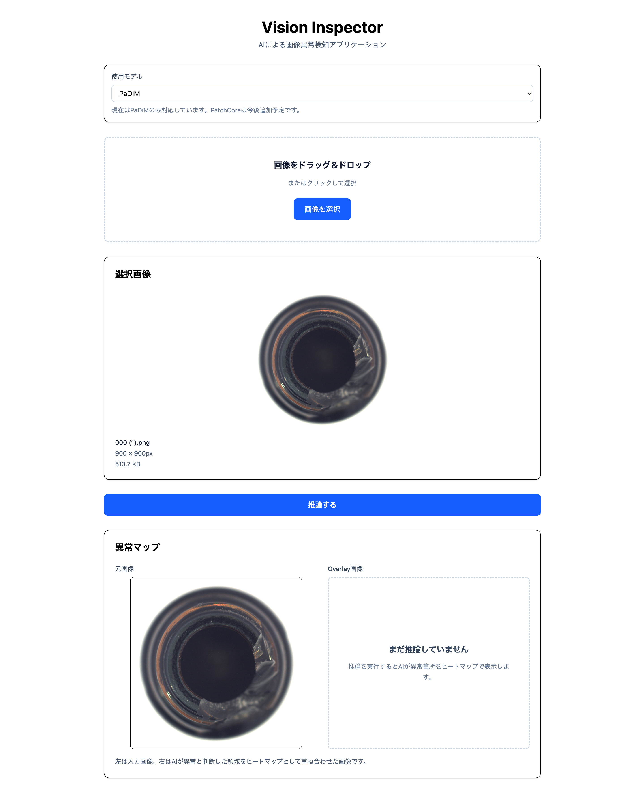
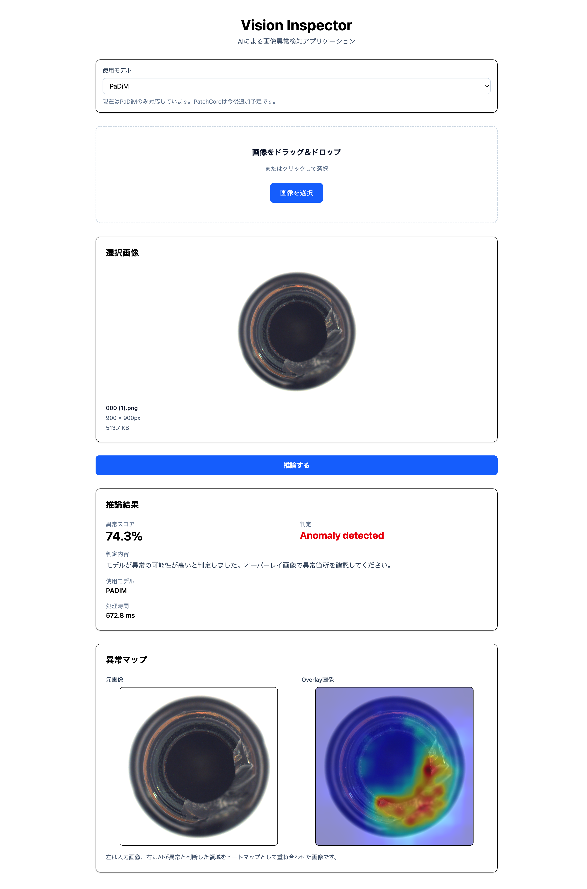
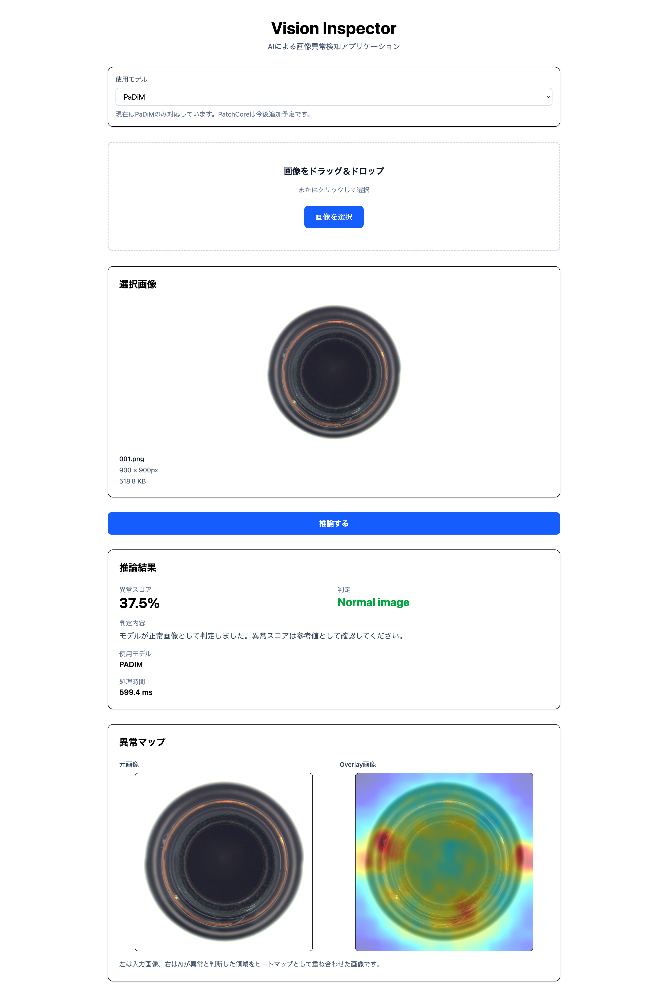
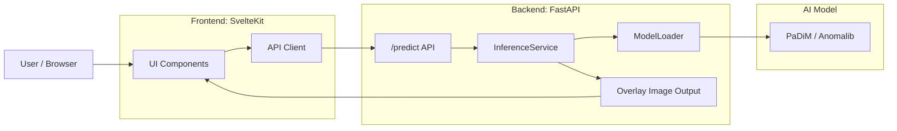
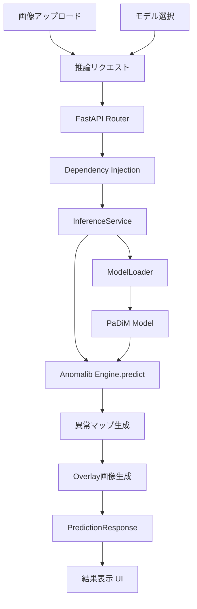

# Vision Inspector


AIによる画像異常検知Webアプリケーションです。

Anomalib（PaDiM）を利用し、画像をアップロードするだけで異常箇所を検出し、ヒートマップ付きの異常マップをブラウザ上で確認できます。

FastAPI・SvelteKit・Docker・uvを利用し、実務を意識した構成で開発しています。

---

## スクリーンショット

### ホーム画面



---

### 推論結果



---

### 正常画像



---

### 異常画像


---

## 開発背景

製造業やインフラ設備などでは、
正常画像のみを用いて異常を検知する手法が重要です。

本プロジェクトでは、
AnomalibのPaDiMを利用し、
画像アップロードから異常検知・ヒートマップ生成までを
ブラウザ上で実行できるWebアプリケーションを開発しました。

---

## 特徴

- PaDiM（Anomalib）による画像異常検知
- 異常ヒートマップ生成
- 元画像とOverlay画像の比較表示
- FastAPI + SvelteKitによるSPA構成
- Docker + uv による開発環境
- Service Layer / DI を採用したバックエンド設計
- Svelte 5 + TypeScript による型安全なフロントエンド
- Ruff・Pyright・pytest・GitHub Actionsによる品質管理

---

## システム構成



---

## アーキテクチャ



---

## ディレクトリ構成

```text
VisionInspector
├── backend
│   ├── app
│   ├── checkpoints
│   ├── tests
│   └── pyproject.toml
│   └── Dockerfile
│   └── Dockerfile.dev
│   └── docker-compose.yml
│
├── frontend
│   ├── src
│   ├── static
│   └── package.json
│
├── docker-compose.yml
└── README.md
```

---

## 技術スタック

| 分類              | 技術             |
| ----------------- | ---------------- |
| Frontend          | SvelteKit 2      |
| Backend           | FastAPI          |
| Deep Learning     | PyTorch          |
| Anomaly Detection | Anomalib (PaDiM) |
| Package Manager   | uv               |
| Lint              | Ruff             |
| Type Check        | Pyright          |
| Test              | pytest           |
| CI                | GitHub Actions   |
| Container         | Docker           |

---

## API

| Method | Endpoint | Description        |
| ------ | -------- | ------------------ |
| POST   | /predict | 画像異常検知を実行 |

画像をアップロードして異常検知を実行します。

### Request

```
multipart/form-data

file : 画像ファイル
model : padim
```

### Response

```json
{
  "model": "padim",
  "score": 0.743,
  "label": true,
  "message": "Anomaly detected",
  "description": "モデルが異常の可能性が高いと判定しました。オーバーレイ画像で異常箇所を確認してください。",
  "overlay_url": "/outputs/xxxxxxxx.png",
  "processing_time_ms": 138.6
}
```

---

## デプロイについて

Frontend は Vercel にデプロイしています。

Backend は Render へのデプロイを試行しましたが、PaDiM モデルは Anomalib / PyTorch / checkpoint の読み込み時に一定のメモリを必要とするため、Render.comの無料プランでは推論時にプロセスが停止する可能性があります。

そのため、現時点では本番推論はローカル Docker 環境での実行を推奨しています。

### 公開状況

| 項目        | 状態                        |
| ----------- | --------------------------- |
| Frontend    | Vercelで公開                |
| Backend API | Renderで `/health` まで確認 |
| AI推論      | ローカルDocker実行を推奨    |

この構成により、UIはブラウザから確認でき、実際のAI推論はローカル環境で再現できます。

---

## セットアップ

```bash
git clone https://github.com/KensukeOta/VisionInspector.git
cd VisionInspector
```

### Backend

```bash
cd backend
docker compose up --build
```

### Frontend

```bash
cd frontend
npm install
npm run dev
```

Frontend

```
http://localhost:5173
```

Backend

```
http://localhost:8000
```

Swagger UI

```
http://localhost:8000/docs
```

---

## Checkpointについて

学習済みPaDiMモデル（checkpoint）はGitHubリポジトリには含めていません。 Dockerビルド時にGitHub Releasesから自動でダウンロードされます。 そのため、追加のダウンロード作業は不要です。

---

## 設計思想

### Service層

推論ロジックをAPI層から分離し、責務を明確化しています。

APIはHTTPリクエストのみを扱い、画像推論はService層が担当します。

---

### ModelLoader

AIモデルの生成・管理をModelLoaderへ集約しています。

将来的にPatchCoreやEfficientADを追加しても、APIやServiceを変更することなく拡張できる構成です。

---

### コンポーネント設計

フロントエンドは

- UIコンポーネント
- Featureコンポーネント

を分離しています。

```text
components
├── ui
└── features
```

これにより、再利用性・保守性を高めています。

---

### Svelte 5

Svelte 5のRunesを採用しています。

親子コンポーネント間の通信は `createEventDispatcher` を使用せず、コールバックPropsで統一しています。

---

### 型安全

Backend

- Pydantic
- Pyright

Frontend

- TypeScript

を利用し、型安全を重視しています。

---

## 品質管理

以下のツールを導入しています。

- Ruff
- Pyright
- pytest
- pre-commit
- GitHub Actions

コミット時およびPush時に自動で品質チェックが実行されます。

---

## 今後の予定

- PatchCore対応
- EfficientAD対応
- モデル切り替え機能
- 推論履歴
- Docker Compose改善
- クラウドデプロイ
- デモ動画作成

---

## ライセンス

MIT License
